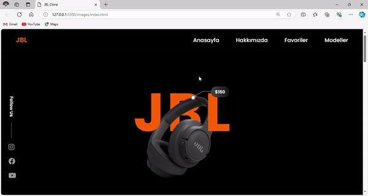

# 🎧 JBL Clone

## 🎥 Demo




## 📖 Description

**JBL Clone** is a responsive web application designed to mimic the sleek and modern aesthetic of JBL's official website. This project showcases various JBL models, their specifications, and features, allowing users to explore and purchase their favorite audio products. The site is built using HTML, CSS, and SCSS for styling, ensuring a visually appealing user experience.

## 🚀 Getting Started

### Prerequisites
- A web browser (Chrome, Firefox, etc.)
- Basic understanding of HTML, CSS, and SCSS

### Installation
Follow these steps to set up the project locally:

1. **Clone the Repository**:
   ```bash
   git clone https://github.com/yasin-erkan/jbl-clone.git
2.Open the Index File: Open index.html in your web browser to view the application.

✨ Features
Responsive Design: Adaptable to various screen sizes, ensuring a seamless experience across devices.
Product Showcase: Displays various JBL models with detailed specifications and features.
User-Friendly Interface: Intuitive navigation that allows users to easily explore products.

🛠️ Technologies Used
HTML: Structure of the web pages.
CSS: Styling and layout design.
SCSS: Advanced styling features for cleaner and more maintainable CSS.

🌟 Future Improvements
JavaScript Functionality: Add interactive elements for enhanced user experience.
Product Filter Options: Implement filters to help users find products based on their preferences.
🤝 Contributing
Contributions are welcome! Feel free to fork this repository and submit pull requests for any enhancements or new features.

📬 Contact
For any questions or feedback, please reach out:

Your Name
Email: yasintahaerkan@gmail.com
Thank you for checking out JBL Clone! We hope you enjoy exploring the world of audio products! 🎶
